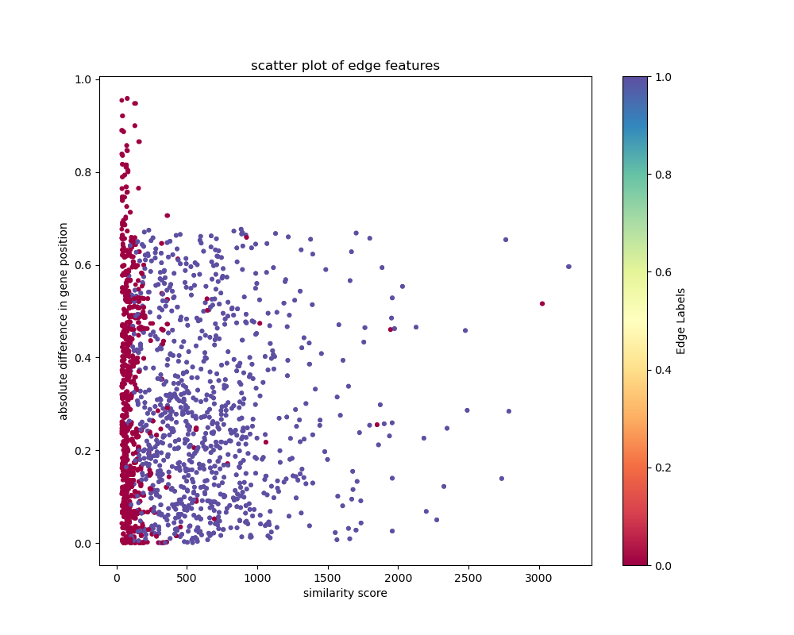
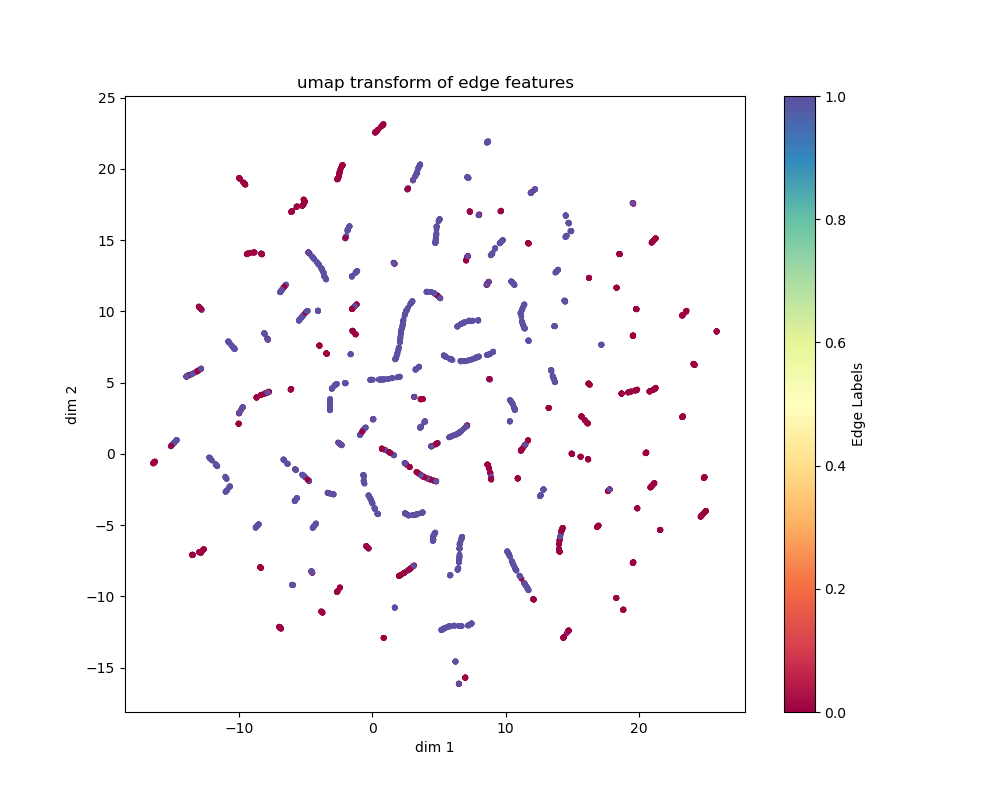
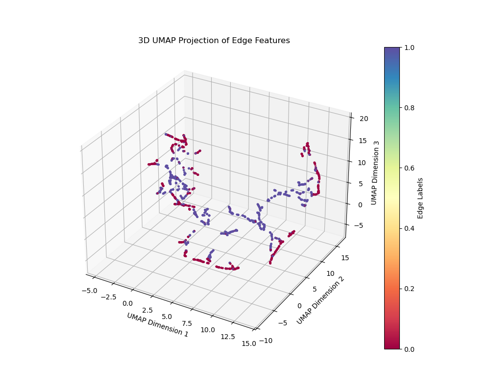
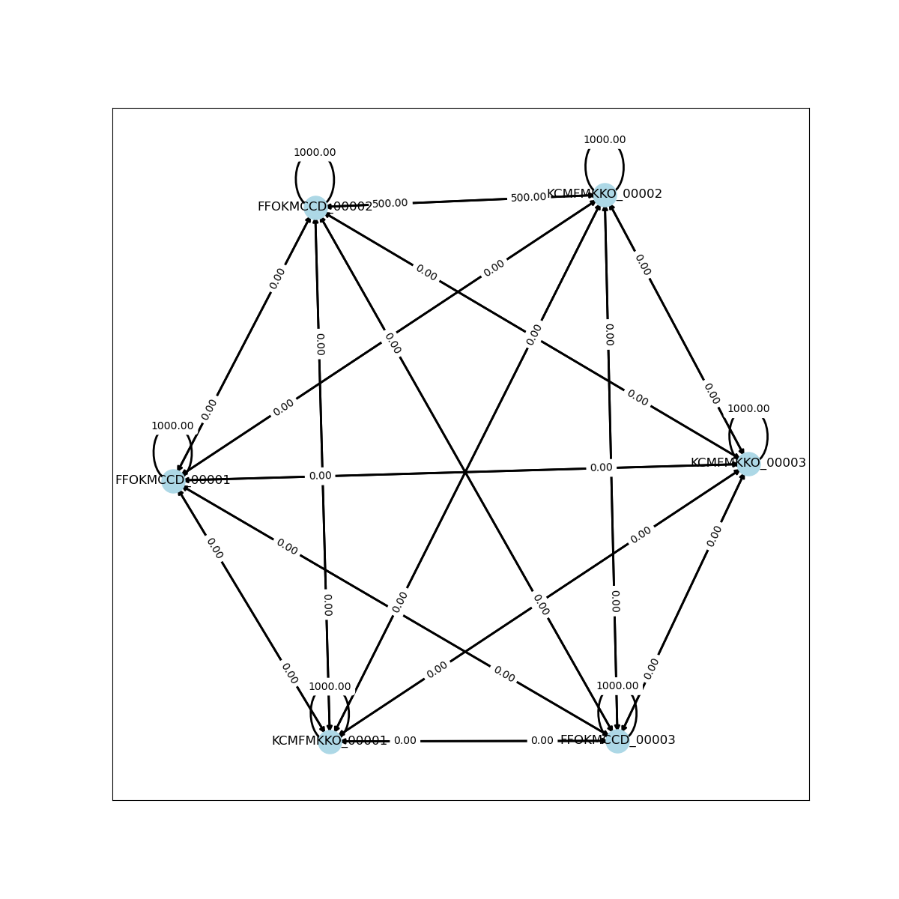

# panGNN
Othologous gene prediction for pan genome construction using graph neural networks.


# how it works
The idea is to use not only the commonly used sequence identity to predict whether two genes are orthologs (since this can be a bad indicator for species with high genetic variance or varying species strains) but also include the neighbourhood information of both genes. We assume here ortholog genes that did not originate from duplication events or transposition in the genome will share a similar genetic neighbourhood (the neighbour genes will be orthologs as well or have a certain sequence identity).

We gene annotation from Prokka for the gene neighbourhood information and run MMSeq on this annotation to cluster genes with similar sequences. This somehow has to be incorporated into a datastructure that we can feed to the graph neural network. Then do some smart convolution and design a training and test dataset. Profit

Now the question is, does this information separate the datapoints somehow?



Not linearly..




Maybe non linearly?


# current state

Currently, the genes are loaded from the GFF files, the similarity scores are loaded from the MMSeqs2 output and used to generate edges between all pairs of genes that have a similarity score. The RIBAP output table (holy table) is then used to check for which pairs of genes both genes are part of the same ribap group, these are assumed to be of prediction class 1 (homolog). The similarity scores are mapped to the edge weights of the input graph in the PyG Data object. Additionally the normalized position of each gene (the position in its GFF file normalized by the total number of genes in that file) is used as node features. Then every gene is represented by a node containing its normalized position and is connected by edges that represent the similarity bit score to its connected gene (node). The idea here is, that genes that are in close proximity in their genomes will be learned to have a higher chance to be homolog when their similarity score is also high, compared to high similarity scores but very different positional node features.

The similarity input graph is then seperated into all individual connected components (sub-graphs), see:



Since genes below the MMSeqs2 similarity threshold will not have an edge connecting them in the input graph, they will not have any influence on each other and the trainiong weights (at least I hope so) in the GNN. The convolution can only occur between nodes connected by a node and only nodes that have a similarity score will be used in the encoding and predcition step. So we can use this to seperate the data into small bits and batch them in groups that we want to train on (also we can use some part of the data like that for test and validation set for now), without destroying relationships in the data (e.g. by randomly sub sampling graphs and breaking edges). The order of the batches is also shuffled during the model training so reduce the risk of fitting the model to the order of the data instead of the data itself.

The first layer of the GNN is a linear (embedding) layer, putting the one dimensional node (input) features into the hidden dim space (which is 64 for now). This is followed by a convolution layer that incorporates the edge weights of each node, it performs a weighted sum of the edge weights connected to each node before multiplying with the learnable parameter matrix. Next is a ReLU activation layer and another convolution layer. After this the node embeddings are decoded by calculating the dot product between pairs of node embeddings to predict links between them. The resulting values (logits if you will so in ML slang I guess) are then fed to a binary cross entropy loss function that applies a sigmoid function to the logits before calculating the loss between them and the 'ground truth' (binary) labels.

However, its not performing very well right now.

# get started
To run the pipeline you will need a working [`Conda`](https://github.com/conda-forge/miniforge) package manager on your machine. A miniforge `Conda` installation is sufficient for this project:

```
wget https://github.com/conda-forge/miniforge/releases/latest/download/Mambaforge-$(uname)-$(uname -m).sh
bash Mambaforge-$(uname)-$(uname -m).sh
```

Install the dependencies first using e.g. the conda environment file in the project directory and activate conda environment:

```
conda env create -f pangnn.yaml
conda activate panGNN
```

Then run pangnn.py in training mode:
```
accelerate launch pangnn.py --train -m model.pkl  -a data/C*gff* -s data/mmseq2_result.csv  -r data/holy_python_ribap_95.csv -e 2 -b 32 -t -n 2 --binary_threshold 0.5 --union_edge_weights -@2
```

or in inference mode (ideally n is unchanged between training and inference):
```
accelerate launch pangnn.py -m model.pkl  -a data/C*gff* -s data/mmseq2_result.csv -n 2 --union_edge_weights -@2
```

To be continued..